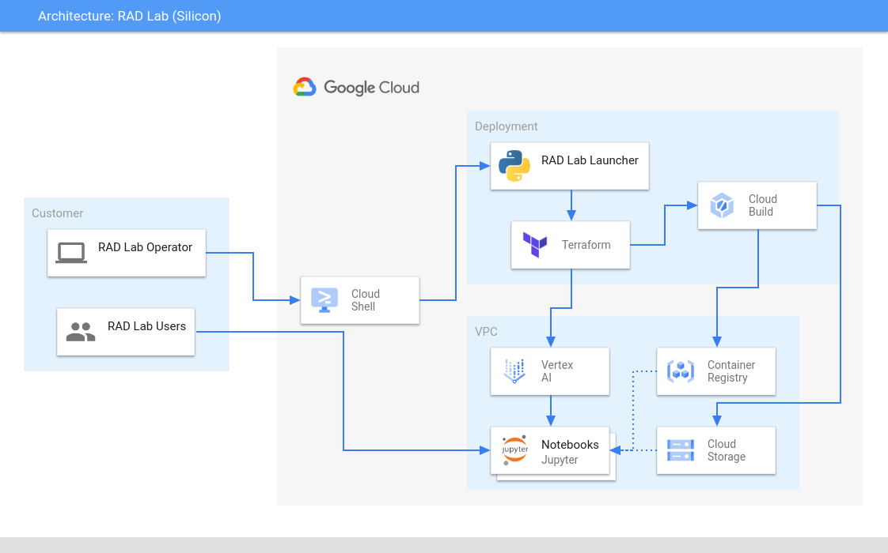

# RAD Lab Silicon Design Module

This RAD Lab module provides a managed environment for custom silicon design using Open Source ASIC toolchains.

## Tools

- [JupyterLab](https://jupyter.org/)
- [SkyWater Open Source PDK](https://github.com/google/skywater-pdk)
- [OpenLane](https://github.com/The-OpenROAD-Project/OpenLane)

## Samples notebooks

- [Inverter](scripts/build/notebooks/inverter/experiment.md)


## GCP Products/Services 

* AI Platform Notebooks
* Virtual Private Cloud (VPC)
* Cloud Storage
* Cloud Build
* Container Registry

## Reference Architecture Diagram

Below Architecture Diagram is the base representation of what will be created as a part of [RAD Lab Launcher](../../radlab-launcher/radlab.py).



## IAM Permissions Prerequisites

Ensure that the identity executing this module has the following IAM permissions, **when creating the project** (`create_project` = true): 
- Parent: `roles/billing.user`
- Parent: `roles/resourcemanager.projectCreator`
- Parent: `roles/orgpolicy.policyAdmin` (OPTIONAL - Only required if setting any Org policy in `modules/[MODULE_NAME]/orgpolicy.tf` as part of RAD Lab module)

When deploying in an existing project, ensure the identity has the following permissions on the project:
- `roles/notebooks.admin`
- `roles/compute.admin`
- `roles/cloudbuild.builds.editor`
- `roles/artifactregistry.admin`
- `roles/storage.admin`
- `roles/resourcemanager.projectIamAdmin`
- `roles/iam.serviceAccountAdmin`
- `roles/iam.serviceAccountUser`
- `roles/serviceusage.serviceUsageAdmin`

NOTE: Additional [permissions](./radlab-launcher/README.md#iam-permissions-prerequisites) are required when deploying the RAD Lab modules via [RAD Lab Launcher](./radlab-launcher)

## Using Terraform module
Here are a couple of examples to use the module directly in your Terraform code, as opposed to using the RAD Lab Launcher.
> NOTE: This module can take upto **50 minutes** to get completely deployed.

### Simple

```hcl
module "simple" {
  source = "./modules/silicon_design"

  billing_account_id = "123456-123456-123465"
  organization_id    = "12345678901"
  folder_id          = "1234567890"
}
```
### Use existing project

This example assumes that all the necessary APIs have been enabled as well.

````hcl
module "existing_project" {
  source = "./modules/silicon_design"

  billing_account_id = "123456-123456-123465"
  organization_id    = "12345678901"
  folder_id          = "1234567890"

  create_project  = false
  project_name    = "silicon-design-project-id"
  enable_services = false
  
  set_external_ip_policy          = false
  set_shielded_vm_policy          = false
}
````

### Existing network

```hcl
module "existing_project_and_network" {
  source = "./modules/silicon_design"

  billing_account_id = "123456-123456-123465"
  organization_id    = "12345678901"
  folder_id          = "1234567890"

  create_project  = false
  project_name    = "silicon-design-project-id"
  enable_services = false
  enable_services = false
  
  create_network = false
  network_name   = "silicon-design-network"
  subnet_name    = "silicon-design-subnetwork"

  set_external_ip_policy          = false
  set_shielded_vm_policy          = false
}
```

<!-- BEGIN TFDOC -->
## Variables

| name | description | type | required | default |
|---|---|:---: |:---:|:---:|
| billing_account_id | Billing Account associated to the GCP Resources | <code title="">string</code> | ✓ |  |
| *boot_disk_size_gb* | The size of the boot disk in GB attached to this instance | <code title="">number</code> |  | <code title="">100</code> |
| *boot_disk_type* | Disk types for notebook instances | <code title="">string</code> |  | <code title="">PD_SSD</code> |
| *create_network* | If the module has to be deployed in an existing network, set this variable to false. | <code title="">bool</code> |  | <code title="">true</code> |
| *create_project* | Set to true if the module has to create a project.  If you want to deploy in an existing project, set this variable to false. | <code title="">bool</code> |  | <code title="">true</code> |
| *enable_services* | Enable the necessary APIs on the project.  When using an existing project, this can be set to false. | <code title="">bool</code> |  | <code title="">true</code> |
| *folder_id* | Folder ID where the project should be created. It can be skipped if already setting organization_id. Leave blank if the project should be created directly underneath the Organization node.  | <code title="">string</code> |  | <code title=""></code> |
| *ip_cidr_range* | Unique IP CIDR Range for AI Notebooks subnet | <code title="">string</code> |  | <code title="">10.142.190.0/24</code> |
| *machine_type* | Type of VM you would like to spin up | <code title="">string</code> |  | <code title="">n1-standard-1</code> |
| *network_name* | Name of the network to be created. | <code title="">string</code> |  | <code title="">ai-notebook</code> |
| *notebook_count* | Number of AI Notebooks requested | <code title="">number</code> |  | <code title="">1</code> |
| *notebook_names* | Names of AI Notebooks requested | <code title="list&#40;string&#41;">list(string)</code> |  | <code title="">[]</code> |
| *organization_id* | Organization ID where GCP Resources need to get spin up. It can be skipped if already setting folder_id | <code title="">string</code> |  | <code title=""></code> |
| *project_name* | Project name or ID, if it's an existing project. | <code title="">string</code> |  | <code title="">radlab-silicon-design</code> |
| *random_id* | Adds a suffix of 4 random characters to the `project_id` | <code title="">string</code> |  | <code title="">null</code> |
| *set_external_ip_policy* | Enable org policy to allow External (Public) IP addresses on virtual machines. | <code title="">bool</code> |  | <code title="">true</code> |
| *set_shielded_vm_policy* | Apply org policy to disable shielded VMs. | <code title="">bool</code> |  | <code title="">true</code> |
| *set_trustedimage_project_policy* | Apply org policy to set the trusted image projects. | <code title="">bool</code> |  | <code title="">true</code> |
| *subnet_name* | Name of the subnet where to deploy the Notebooks. | <code title="">string</code> |  | <code title="">subnet-ai-notebook</code> |
| *trusted_users* | The list of trusted users. | <code title="set&#40;string&#41;">set(string)</code> |  | <code title="">[]</code> |
| *zone* | Cloud Zone associated to the AI Notebooks | <code title="">string</code> |  | <code title="">us-east4-c</code> |

## Outputs

| name | description | sensitive |
|---|---|:---:|
| artifact_registry_repository_id | Artifact Registry Repository ID |  |
| deployment_id | RAD Lab Module Deployment ID |  |
| notebooks_bucket_name | Notebooks GCS Bucket Name |  |
| notebooks_container_image | Container Image URI |  |
| notebooks_instance_names | Notebook Instance Names |  |
| project_radlab_silicon_design_id | Silicon Design RAD Lab Project ID |  |
<!-- END TFDOC -->

## Access RAD Lab Silicon Design Notebooks

Follow the instructions under [gcp-ai-nootbook-tools Readme](./scripts/usage/README.md).
